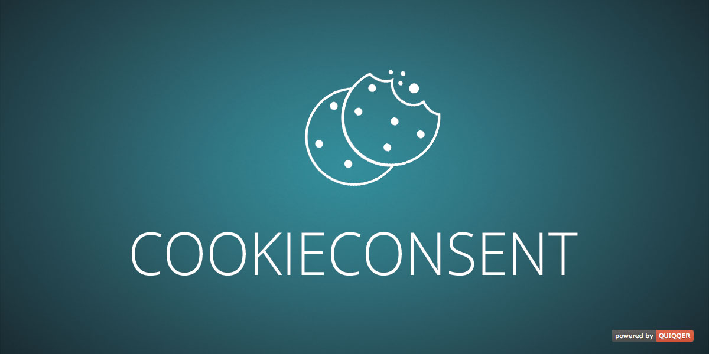

Cookie Consent
========

The Cookie Consent module integrates a cookies-notification concerning the EU-guideline for your QUIQQER-Website. 
If data protection specifications have been declared, those will be linked automatically. 

Package name:

    quiqqer/gdpr

Features
--------

- Prefabricated Cookie Consent text can be replaced
- Cookie Consent notice can be customized

Installation
------------

Tha package name is: quiqqer/gdpr

Contribute
----------

- Issue Tracker: https://dev.quiqqer.com/quiqqer/cookieconsent/issues
- Source Code: https://dev.quiqqer.com/quiqqer/cookieconsent

Support
-------

If you have found errors, wishes or suggestions for improvement,
you can contact us by email at support@pcsg.de.

We will try to meet your needs or send them to the responsible developers
of the project.

Lizenz
-------

GPL-3.0+
